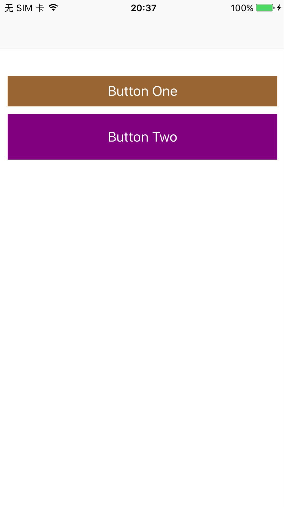

# DLSimpleAutolayout

这是语法类似 Masonry，但是实现上更为简单的 autolayout 封装。


## 使用方式

手动添加 [`DLSimpleAutolayout `](https://github.com/danleechina/DLSimpleAutolayout/tree/master/DLSimpleAutolayoutDemo/DLSimpleAutolayout) 到工程中。


## 用法

Demo 中的布局效果如下：

<p align="center"></p>

代码如下：

```
	@[
	  self.button1.dl_top.equalTo(self.view).offset(100),
	  self.button1.dl_left.equalTo(self.view).offset(10),
	  self.button1.dl_right.equalTo(self.view).offset(-10),
	  self.button1.dl_height.equalTo(@40),
	].dl_constraint_install();
	    
	@[
	  self.button2.dl_top.equalTo(self.button1.dl_bottom).offset(10),
	  self.button2.dl_left.equalTo(self.button1),
	  self.button2.dl_right.equalTo(self.button1),
	  self.button2.dl_height.equalTo(@60),
	].dl_constraint_install();

```


## 贡献者

作者: [@粉碎音箱的音乐(weibo)](http://weibo.com/u/1172595722) 

Blog: [Blog](http://danleechina.github.io/)

## 需要 Star！

如果你觉得 `DLSimpleAutolayout ` 有用的话，请点个 star 呗！谢谢啦。😄

